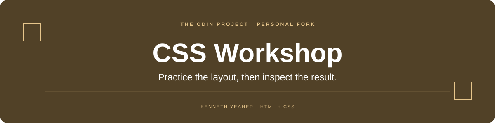

  

  
  

<a href="foundations/">Foundations</a> &nbsp; · &nbsp; <a href="intermediate-html-css/">Intermediate exercises</a> &nbsp; · &nbsp; <a href="advanced-html-css/">Advanced exercises</a>

## Overview

A personal practice fork of The Odin Project’s CSS exercise collection. It keeps the original prompts, desired-outcome images, self-checks, and reference solutions together so each exercise can be studied in context.

This repository is a personal fork of [the original exercise collection](https://github.com/TheOdinProject/css-exercises). The original instructions are retained below.

## At a glance

| Area | What to look for |
| --- | --- |
| **Foundations** | Selectors, the cascade, spacing, and Flexbox. |
| **Intermediate** | Grid positioning and larger responsive layouts. |
| **Advanced** | Animation exercises, including hover, popup, and dropdown behavior. |

## Start here

Choose an exercise, read its local README, and open its `index.html` in a browser. Compare your work with the provided outcome and self-check before reading the solution.

## Scope

The exercise collection, prompts, and reference solutions belong to The Odin Project and its contributors. This fork does not claim authorship of the upstream curriculum or completion of every exercise.

---

<strong>Original upstream guide and contribution instructions</strong>

# CSS Exercises

These exercises consist of a series of CSS-related tasks intended to complement the HTML and CSS content on The Odin Project (TOP). They should only be completed when instructed during the course of the curriculum.

When doing these exercises, please use all documentation and resources you need to accomplish them. You are _not_ intended to have any of this stuff memorized at this point. Check the docs, use Google, and do what you need to do (besides checking the solutions) to get them done.

> [!IMPORTANT]
> We encourage you to practice your git skills by committing your changes and pushing them to your own fork.  However, please **DO NOT** open a Pull Request to have your solutions merged into this repo or to show your solution.  If we were to merge your changes the exercises would no longer be available as intended for new learners, and opening a PR only causes additional work for us, as we have to close it without merging.

## Contributing

If you have suggestions to improve an exercise, ideas for a new exercise, or notice an issue with an exercise, please feel free to open an issue after thoroughly reading our [contributing guide](https://github.com/TheOdinProject/.github/blob/main/CONTRIBUTING.md).

## How To Use These Exercises

1. Fork and clone this repository. To learn how to fork a repository, see the GitHub documentation on how to [fork a repo](https://docs.github.com/en/get-started/quickstart/fork-a-repo).
    - Copies of repositories on your machine are called clones. If you need help cloning to your local environment, you can learn how from the GitHub documentation on [cloning a repository](https://docs.github.com/en/github/creating-cloning-and-archiving-repositories/cloning-a-repository-from-github/cloning-a-repository).
1. Go to an exercise directory and open the HTML file in a web browser. You can open the file directly or use something like VSCode's Live Server extension.
1. For each exercise, read the README thoroughly before starting any work.
    - Each README has a "Self Check" list. Use this to ensure you haven't missed any important details in your implementation.
1. Make your edits in the `index.html` and/or the `style.css` files in order to make the output in your browser look like the Desired Outcome image(s).
    - Depending on the instructions of the exercise, you may only need to make edits in one of these files.
1. Once you successfully finish an exercise, check TOP's solution to compare it with yours.
    - You should not be checking the solution for an exercise until you finish it!
    - If your solution differs wildly from TOP's solution (and still passes the exercise's requirements), that's completely fine. Do feel free to ask about it in our Discord if there are parts you do not understand.

> [!IMPORTANT]
> Do not submit your solutions to this repo, as any PRs that do so will be closed without merging.

## Some Hints
- The official solutions put all changes at the _end_ of the CSS file, which may duplicate some selectors (e.g. there might be a `body {}` in the given CSS and another `body {}` in the solution). When you are working on an exercise, it is best practice to add your CSS to existing selectors instead of duplicating them at the end of the file. We're sacrificing this best practice in our official solutions to make it extra clear to you what things we changed to solve the exercise.
- Unless listed in the self-check section, do not worry about getting the exact pixel value for things like margin, padding and font size. These exercises are intended to test your knowledge of CSS, not your ability to guess that a screenshot is using `font: sans-serif bold 16px` or that the margin is _exactly_ `42px`.
- You may need to add some elements to your HTML to get things into the right spot. (For the first few exercises, we make it explicit when this needs to happen.)
- You may need to add more selectors to your CSS file. The first few exercises have almost everything already done for you, but as you progress, you'll find that you need to add more and more selectors to get the correct result.

